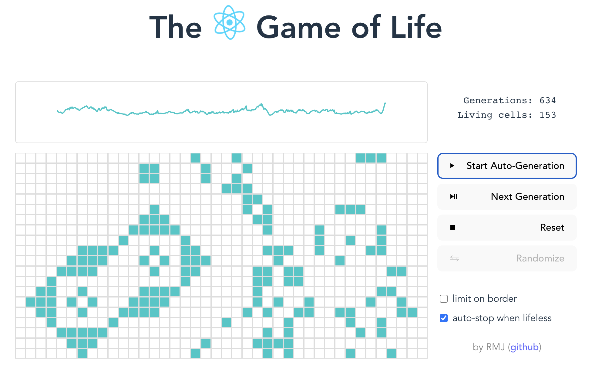

# react-game-of-life

[](https://github.com/LionyxML/react-game-of-life/actions/workflows/test_and_deploy.yml)

A ReactJS App based on Conway's Game of Life

You can see it working here: [React-Game-Of-Life](https://lionyxml.github.io/react-game-of-life)



### Install

In order to install this App simply run:

```
npm install
```

### Development

You can run a development server with:

```
npm run dev
```

And access the App on your localhost, following the provided command response link.

### Style and Syntax Enforcement

This project enforces styles and syntaxes with the use of:

- ESLint
- Prettier
- TypeScript

You may find checking and fixing scripts inside the `package.json` file.

### Build

You may build using:

```
npm run build
```

The resulting artifact will be ready on the `dist/` folder.

### Deploy

There's an automated script for github actions that runs tests, builds and deploy to the github-pages URL of the project.

One may also want do force a manual deploy, for this you can execute the `manual_deploy.sh` script.
